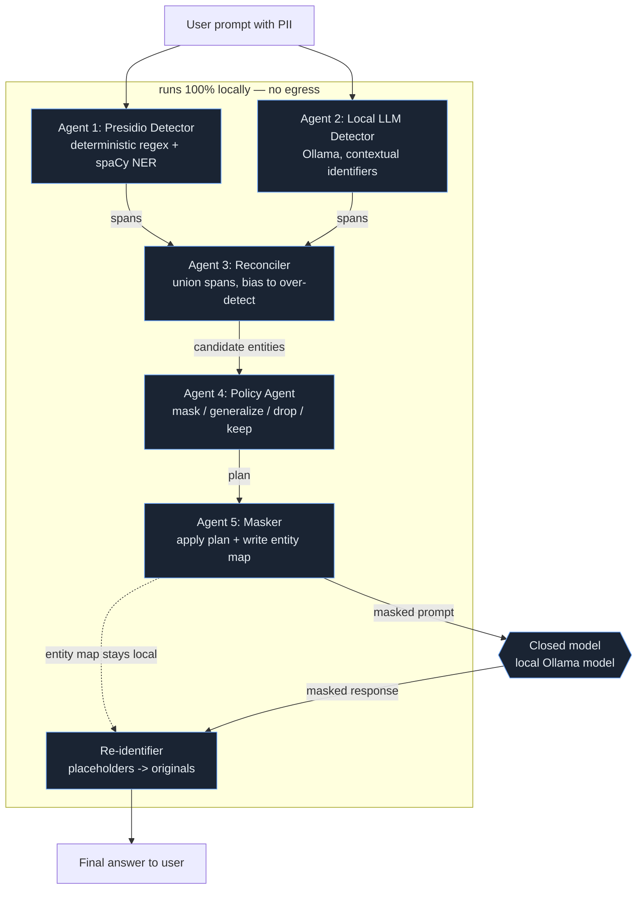

# 🔒 CloseAI

**De-identified LLM chats.** CloseAI strips personally identifying information
out of a prompt *locally* before it is ever sent to a closed-source model
(OpenAI, Anthropic, …), then **re-identifies** the answer that comes back. The
closed model only ever sees placeholders like `[PERSON_1]`; the user sees a
natural, fully-restored reply.

The de-identification is **multi-agent**, and every agent step is traced with
**W&B Weave**, so the whole collaboration is observable, evaluable, and tunable.

> Threat model: the closed model is *untrusted*. Anything that uniquely
> identifies a person must not leave the machine in raw form. A false positive
> costs a little utility; a false negative is a leak — so we deliberately bias
> toward over-detection.

---

## Architecture



Every box in the local subgraph (plus the model call) is a `weave.op`, so one
call to `deidentify_and_query` renders as a full **trace tree** in Weave.

### Why "detect & mask" is *three* detection agents, not one

| Agent | Role | Catches | Misses |
|------|------|---------|--------|
| **Presidio** | fast, deterministic | emails, phones, SSNs, cards, names/locations via spaCy NER | contextual / implicit identifiers |
| **Local LLM (Ollama)** | contextual reasoning | "my manager at the Cambridge office", "the only female VP" | structured noise, exact spans |
| **Reconciler** | union + merge | combines both, **biases to over-detection** | — |

Then the **Policy agent** decides *per entity* what to do — this is the
privacy-vs-utility knob. The goal is to keep the outgoing prompt **natural
English** (so the closed model doesn't refuse or get confused) while leaking
nothing:

- **surrogate** → swap in a realistic fake of the same type, reversible
  (`Jane Doe` → `Maria Lopez`, a real email → a fake email). Used for `PERSON`,
  `EMAIL`, `PHONE`, `ORGANIZATION`, `LOCATION`. Restored after the model answers.
- **describe** → natural-language coarsening of metrics (`37` → "in their late
  30s", a date → "around 2024", `SSN` → "a confidential number"). Irreversible.
- **drop** → deleted entirely (available for anything too sensitive to even fake).
- **keep** → low-risk, high-utility text left untouched.

The **Masker** applies the plan and writes the `entity_map` (surrogate →
original) — the only artifact that can undo the masking, and it never leaves the
process. Surrogates come from `Faker` when installed, with a built-in fallback.

---

## Quickstart

```bash
python -m venv .venv && source .venv/bin/activate
pip install -r requirements.txt
python -m spacy download en_core_web_lg     # for the Presidio agent

cp .env.example .env                          # then edit as needed
export OPENAI_API_KEY=...                     # default closed-model provider
wandb login                                   # for Weave tracing
```

The default demo path uses OpenAI (`CLOSEAI_PROVIDER=openai`). For an offline
round-trip, set `CLOSEAI_PROVIDER=echo`; without Presidio it falls back to
regex, and without Ollama it skips the LLM detector.
Weave traces redact raw prompts, entity maps, and re-identified answers by
default; set `CLOSEAI_TRACE_RAW=1` only for fully synthetic demos.

### CLI

```bash
# Full round-trip (de-identify -> model -> re-identify)
python cli.py "My name is Jane Doe. Write a one-line greeting that addresses me by name."
# -> closed model sees a fake name; you see "Hello Jane Doe, ..."

# Offline fallback (no API key)
python cli.py --provider echo "Hi, I'm Jane Doe (jane@acme.com)."

# Just show what would be masked
python cli.py --deidentify-only "My manager at the Cambridge office is 37."

# Pin a specific model
python cli.py --provider ollama --model llama3.2 "Hi, I'm Jane Doe (jane@acme.com)."
```

### Web demo

```bash
uvicorn app.server:app --reload --port 8000
# open http://localhost:8000
```

The UI shows the original prompt with color-coded highlights, the masked prompt
that actually leaves the machine, the raw (masked) model response, and the
re-identified answer.

### Local LLM detector (Ollama)

Agent 2 runs a small model **locally** through Ollama to catch contextual
identifiers Presidio misses. It uses Ollama [structured outputs](https://docs.ollama.com/structured-outputs)
(a JSON schema) so even small models return reliable spans.

```bash
ollama serve
ollama pull llama3.2          # or any instruct model you like
export OLLAMA_MODEL=llama3.2
```

If `OLLAMA_MODEL` isn't installed, the agent **auto-selects** an installed model
(preferring general instruct models), so it works out of the box with whatever
you already have. Set `OLLAMA_MODEL` to pin a specific one, or
`ENABLE_LLM_DETECTOR=0` to turn the agent off.

---

## W&B Weave (sponsor integration)

1. **Tracing** — `closeai/observability.py` aliases `@op` to `weave.op`. Set
   `WEAVE_PROJECT` and call the pipeline; the multi-agent trace tree appears in
   Weave automatically. (`weave.init` is called once on pipeline construction.)
2. **Evaluation** — `eval/evaluate.py` uses Weave's `EvaluationLogger` to log
   per-example **recall** (the leak metric), precision, and detection counts
   against `eval/dataset.jsonl`:

   ```bash
   python eval/evaluate.py
   ```

   Recall is the metric to optimize: a missed entity is a leak. With only the
   regex fallback, recall ≈ 0.55; turning on the Presidio NER + Ollama agents
   drives it toward 1.0 — a clean before/after to demo.
3. **Hill-climbing with the W&B MCP** — point a coding agent at the Weave
   project via the [W&B MCP server](https://docs.wandb.ai/platform/mcp-server)
   and have it read the eval metrics and tune the policy map / thresholds in
   `closeai/config.py` automatically.

---

## Project layout

```
closeai/
  schemas.py          # Span, EntityDecision, MaskResult, PipelineResult
  config.py           # Settings + the per-entity POLICY map (the tuning knob)
  observability.py    # Weave @op wrapper with graceful no-op fallback
  llm_client.py       # closed model client (OpenAI/Anthropic/W&B/Ollama/echo)
  pipeline.py         # orchestrator: the top-level traced flow
  agents/
    presidio_detector.py   # agent 1  (+ regex fallback)
    llm_detector.py        # agent 2  (Ollama)
    reconciler.py          # agent 3
    policy.py              # agent 4
    masker.py              # agent 5
    reidentifier.py        # post-response restore
app/
  server.py           # FastAPI API + serves the demo UI
  static/index.html   # single-page demo
eval/
  evaluate.py         # Weave EvaluationLogger harness
  dataset.jsonl       # tiny labeled PII benchmark
tests/
  test_pipeline.py    # dependency-free smoke tests
cli.py
```

## How it maps to the judging criteria

- **Agent orchestration** — five specialized agents + a re-identifier, each a
  distinct Weave-traced step that visibly collaborates.
- **Utility** — lets people use the best closed models without handing them raw
  PII; a real privacy problem.
- **Technical execution** — deterministic + LLM detection unioned with an
  over-detection bias, a policy layer for utility, reversible masking, graceful
  degradation everywhere, and tests.
- **Creativity** — the *re-identification* round-trip and the three-detector
  reconciler are the novel bits.
- **Sponsor usage** — W&B Weave for tracing **and** evaluation, plus the W&B MCP
  for auto-tuning. (The closed model runs locally via Ollama, so nothing leaves
  the machine even during the demo.)
